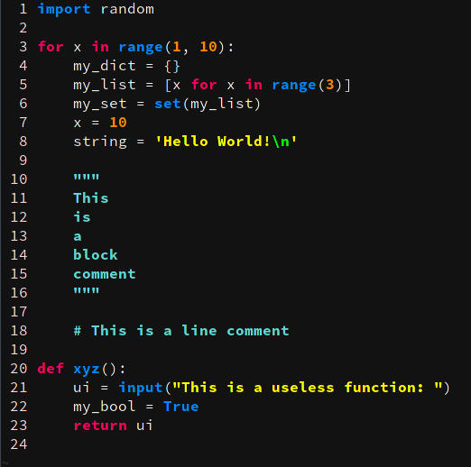

# pynux
This is my custom vim colorscheme, I really liked the [cobalt colorscheme](https://github.com/sfsekaran/cobalt.vim), but wanted to change some of the colors around for my own personal preferenes, so I simply messed around with that file.

Just add pynux.vim to your ~/.vim/colors folder and add the following lines to your ~/.vimrc:

```
syntax on
colorscheme pynux
``` 

Also I didn't extensively look into every category, so if you find anything 
ugly or inconsistent, let me know and I will fix it!



